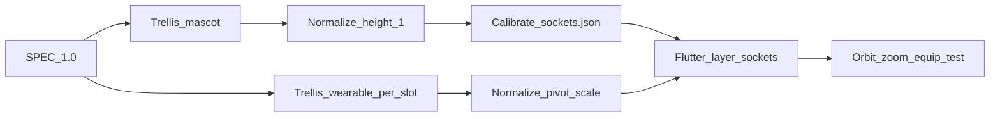

# Specyfikacja 3D: maskotki + ubranka do zakładania

**Projekt:** Dialectium (Anielka)  
**Silnik generacji:** lokalny Trellis (`:8004`)  
**Wersja dokumentu:** 1.0  
**Status:** obowiązująca — generacja i kod muszą tego przestrzegać

---

## 1. Cel

Użytkownik w aplikacji:

1. Widzi **bazową maskotkę** (kot / pies) jako GLB.
2. **Zakłada / zdejmuje** ubranka i akcesoria ze sklepu / garderoby.
3. Może **obracać i powiększać** podgląd 3D (jak w Trellis: orbit + zoom).

Dlatego:

| Typ assetu | Co generujemy | Czego NIGDY nie generujemy |
|------------|---------------|----------------------------|
| Maskotka | Same zwierzę, bez ciuchów i mebli | Kot w łóżku, pies w czapce |
| Ubranko / akcesorium | Sam kształt do **nałożenia** na maskotkę | Ludzka sukienka, wieszak, manekin, stojak |
| Pokoik (miska, posłanie…) | Sam mebel / zabawka, **pusta** | Zwierzę siedzące w / na przedmiocie |

**Zakaz absolutny:** wieszaki, stojaki, manekiny, ludzkie proporcje ubrań, „product on hanger”.

---

## 2. Jednostki i pozowanie bazowe

### 2.1 Jednostki

- 1 jednostka = 1 metr w glTF (nieistotne fizycznie — liczy się **skala względna**).
- **Wysokość maskotki siedzącej** (od podłoża do czubka uszu) ≈ **1.0**.
- Wszystkie ubranka skalujemy względem tej bazy.

### 2.2 Poza bazowa (obie maskotki)

Obie GLB (`mascot_cat`, `mascot_dog`) muszą być w **tej samej konwencji**:

- Siedząca, przód + lekko ¾ w stronę kamery (+Z).
- Podłoże: stopy / pupa na **Y = 0**.
- Środek sylwetki na **X = 0**, głębokość środka na **Z = 0**.
- Głowa u góry (+Y), pysk w +Z.

Dzięki temu sockety są wspólne dla kota i psa (lekka różnica skali head/neck OK).

### 2.3 Bounding box referencyjny (po imporcie)

Po wygenerowaniu Trellisem **normalizujemy** GLB (skrypt / Blender) tak, by:

```
height ≈ 1.0
center_xz ≈ (0, 0)
min_y ≈ 0
```

Bez normalizacji sockety się rozjadą.

---

## 3. Sockety (punkty mocowania)

Każdy slot garderoby z aplikacji (`MascotSlot`) ma socket w przestrzeni maskotki.

| Slot aplikacji | Socket ID | Pozycja lokalna (x, y, z) | Orientacja (przybliżona) | Skala domyślna |
|----------------|-----------|---------------------------|---------------------------|----------------|
| `head` | `sock_head` | `(0.00, 0.78, 0.05)` | Y-up | `1.0` |
| `face` | `sock_face` | `(0.00, 0.62, 0.22)` | pysk +Z | `1.0` |
| `neck` | `sock_neck` | `(0.00, 0.48, 0.08)` | Y-up | `1.0` |
| `body` | `sock_body` | `(0.00, 0.32, 0.00)` | Y-up, wzdłuż tułowia | `1.0` |
| `special` | `sock_special` | `(0.00, 0.40, -0.15)` | tył / bok | `1.0` |

**Uwagi:**

- Wartości to **start**; po pierwszym dobrym `mascot_cat.glb` kalibrujemy je raz w `assets/models3d/sockets.json` i nie zmieniamy bez bumpa wersji spec.
- Pies może mieć osobny plik `sockets_dog.json` tylko jeśli różnica > ~8%; domyślnie wspólne.

### 3.1 Plik `sockets.json` (kontrakt)

```json
{
  "spec": "1.0",
  "mascot_height": 1.0,
  "sockets": {
    "head":   { "pos": [0, 0.78, 0.05], "rot_euler_deg": [0, 0, 0], "scale": 1 },
    "face":   { "pos": [0, 0.62, 0.22], "rot_euler_deg": [0, 0, 0], "scale": 1 },
    "neck":   { "pos": [0, 0.48, 0.08], "rot_euler_deg": [0, 0, 0], "scale": 1 },
    "body":   { "pos": [0, 0.32, 0.00], "rot_euler_deg": [0, 0, 0], "scale": 1 },
    "special":{ "pos": [0, 0.40,-0.15], "rot_euler_deg": [0, 0, 0], "scale": 1 }
  }
}
```

Aplikacja czyta ten plik i ustawia transform GLB ubranka jako dziecko socketu.

---

## 4. Geometria ubranek (jak mają wyglądać w 3D)

Ubranko **nie jest** ludzkim ciuchem. To **kształt dopasowany do czworonoga kawaii**.

### 4.1 Szablony per slot

| Slot | Kształt docelowy | Jak wygląda w Trellis (prompt-idea) |
|------|------------------|-------------------------------------|
| `head` — kokardka | Dwie pętle + węzeł, **bez głowy zwierzęcia** | „small ribbon bow, two loops, free-floating accessory, origin at knot center” |
| `head` — czapka / tiara | Opaska / półokrąg **otwarty od dołu**, wewnętrzna średnica ≈ głowa | „open bottom pet-sized tiara band, hollow inside, no head inside” |
| `face` — okulary | Dwa okręgi + mostek, płaskie | „cartoon glasses frame only, no face” |
| `neck` — szalik / obroża | **Pierścień / torus / pętla** wokół osi Y | „thick fabric collar ring, toroidal scarf loop, hollow center for neck” |
| `body` — sweter / sukienka / peleryna | **Rurka / dzwon na tułów**, otwór na szyję u góry, otwór na tylne łapy / pupę u dołu; **bez rękawów ludzkich, bez biustu, bez wieszaka** | „short cartoon pet sweater tube, neck hole on top, open bottom, quadruped torso wrap, no hanger, no mannequin, no human dress” |
| `special` — buciki | Para małych bucików **obok siebie**, puste w środku | „pair of tiny empty pet booties, hollow, side by side” |
| `special` — skrzydełka / plecak | Mesh z pivotem przy grzbiecie | „small backpack prop, straps facing -Z toward body” |

### 4.2 Pivot (punkt zerowy) mesh ubranka

W pliku GLB ubranka:

- **Origin (0,0,0)** = punkt mocowania do socketu (np. środek kokardki, środek pierścienia szalika, środek otworu szyi swetra).
- Mesh może wystawać w ±X/Y/Z, ale pivot musi być logiczny — aplikacja **nie** szuka automatem środka bbox (to psuje kokardki).

### 4.3 Skala

Po normalizacji maskotki:

| Slot | Orientacyjna szerokość ubranka |
|------|--------------------------------|
| head (kokarda) | ~0.25–0.35 |
| neck (pierścień) | średnica wewnętrzna ~0.22–0.28 |
| body (rurka) | wysokość ~0.25–0.40, średnica ~0.45–0.55 |

Jeśli Trellis wygeneruje „giganta”, pipeline normalizacji skaluje do tych widełek (`scripts/normalize_wearable_glb.py` — do dopisania).

---

## 5. Warstwy w aplikacji (runtime)

```
Scene
 └─ MascotRoot (orbit camera / model_viewer lub Scene)
     ├─ MascotBody.glb          // mascot_cat | mascot_dog
     ├─ Socket head
     │    └─ item_head.glb      // jeśli equipped['head']
     ├─ Socket face → …
     ├─ Socket neck → …
     ├─ Socket body → …
     └─ Socket special → …
```

**Zasady UI:**

1. Jednocześnie max **jeden** item na slot (`equipped[slot] = id`).
2. Brak GLB dla id → fallback 2D (`OutfitPainter` / `DressedKicia`) jak dziś.
3. Podgląd sklepu: sam item na ciemnym tle **albo** item już nałożony na maskotkę (preferowane: „przymierz”).
4. Orbit + zoom — bez zmian względem Trellis preview.

Home items (`bowl`, `bed`, …) **nie** wiszą na socketach garderoby — to props w pokoiku (osobne pozycje `HomeSlot`), też bez zwierząt w meshu.

---

## 6. Katalog plików

```
assets/models3d/
  mascot_cat.glb
  mascot_dog.glb
  sockets.json
  bow_gold.glb
  dress_sparkle.glb
  …
  meta/
    dress_sparkle.json    # opcjonalnie: slot, pivot hint, scale override
```

### 6.1 Meta itemu (`meta/<id>.json`)

```json
{
  "id": "dress_sparkle",
  "slot": "body",
  "kind": "wearable",
  "pivot": "neck_hole_center",
  "scale": 1.0,
  "spec": "1.0"
}
```

`kind`:

- `wearable` — sockety garderoby  
- `home` — pokoik  
- `mascot` — baza  

---

## 7. Generacja Trellis — kontrakt promptów

### 7.1 Maskotka (`kind: mascot`)

- Tylko zwierzę.
- Negative: furniture, clothes, accessories, bed, bowl, hanger…

### 7.2 Wearable (`kind: wearable`)

**Zakazane słowa w prompcie:**  
`hanger, mannequin, stand, rack, human, woman, girl, dress form, model, person, bust, torso of person, sleeve for arms`  
oraz (żeby nie doklejał zwierzaka):  
`cat, dog, pet, animal, kitten, puppy, wearing, worn by`

**Wymagane frazy (przykład body):**

> cartoon quadruped pet sweater shell, hollow tube for animal torso, round neck hole on top, open bottom, no hanger, no mannequin, no human clothing, single garment mesh, studio lighting

**Negative (opts.sdxl_negative):**  
`hanger, clothing rack, mannequin, human, person, woman, girl, cat, dog, animal, pet, face, sitting creature, full body character`

### 7.3 Home prop (`kind: home`)

Puste meble / zabawki; negative jak wyżej + `creature inside`.

### 7.4 QA przed akceptacją

Odrzuć i usuń z historii Trellis, jeśli w preview widać:

1. Wieszak / stojak / manekin  
2. Ludzki krój (biust, spaghetti straps na ludzką sylwetkę)  
3. Zwierzę w / na przedmiocie  
4. Ubranko „przyklejone” na zwierzęciu w jednym meshu  

---

## 8. Pipeline (kolejność pracy)



1. Wygenerować i znormalizować **maskotki**.  
2. Ustawić `sockets.json` (raz).  
3. Generować wearables **per slot** według §4 i §7.  
4. Normalizacja pivot/skali.  
5. Test w apce: ubierz / zdejmij / obróć.  
6. Dopiero potem release.

**Nie generować** kolejnych „sukienek na wieszaku” — to łamie SPEC.

---

## 9. Mapowanie ID → slot (sklep)

| id | slot | kind | szablon geometrii |
|----|------|------|-------------------|
| `dress_sparkle` | body | wearable | rurka / dzwonek na tułów |
| `bow_gold` | head | wearable | kokarda |
| `boots_pink` | special | wearable | para bucików |
| `tiara_crystal` | head | wearable | otwarta tiara / opaska |
| `scarf_rainbow` | neck | wearable | pierścień szalika |
| `bowl_*` | — | home | miska |
| `bed_*` | — | home | puste posłanie |
| `toy_*` / `plant_*` / `lamp_*` | — | home | prop |

Garderoba levelowa (`bow_pink`, `sweater_yellow`, …) — **ten sam** system, te same sockety.

---

## 10. Odpowiedzialność kodu

| Element | Plik / miejsce |
|---------|----------------|
| Spec (ten dokument) | `docs/MASCOT_3D_WEARABLES_SPEC.md` |
| Katalog generacji | `scripts/mascot_3d_catalog.json` |
| Skrypt Trellis | `scripts/generate_mascot_3d_trellis.sh` |
| Sockety | `assets/models3d/sockets.json` |
| Viewer + equip | `lib/model3d_viewer.dart`, `lib/mascot.dart` |

Zmiana pozycji socketów = bump `spec` w JSON + krótka notka w changelogu aplikacji.

---

## 11. Podsumowanie w jednym zdaniu

**Maskotka = naga baza; ubranko = osobny mesh z pivotem na sockecie, w kształcie dla czworonoga, nigdy ludzki ciuch na wieszaku i nigdy zwierzę wbudowane w przedmiot.**
